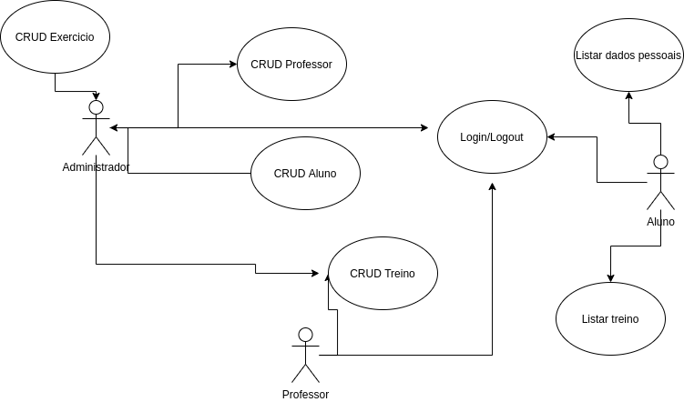

## Equipe e Definição de Papéis

Membro     |     Papel   |   E-mail   |
---------  | ----------- | ---------- |
Laio    |  Desenvolvedor  | laioand98@gmail.com

### Matriz de Competências

Membro     |     Competências   |
---------  | ----------- |
Laio    | Desenvolvedor JavaScript, Go |

## Perfis dos Usuários

O sistema poderá ser utilizado por diversos usuários. Temos os seguintes perfis/atores:

Perfil                                 | Descrição   |
---------                              | ----------- |
Administrador | Este usuário realiza os cadastros base e pode realizar qualquer função.
Alunos | Este usuário pode verificar seus dados pessoais, e acessar treinos passados pelos professores.
Professores | Este usuário pode cadastrar novos treinos para os alunos.

## Lista de Requisitos Funcionais

Requisito                                 | Descrição   | Ator |
---------                                 | ----------- | ---------- |
RF001 - Cadastrar Aluno | Um aluno representa um aluno matriculado na academia. Um aluno tem nome, endereço, sexo, data de nascimento, username, senha, mensalidade, data de matricula. | Administrador |
RF002 - Listar Aluno | Um aluno representa um aluno matriculado na academia. Um aluno tem nome, endereço, sexo, data de nascimento, username, senha, mensalidade, data de matricula. | Administrador |
RF003 - Atualizar Aluno | Um aluno representa um aluno matriculado na academia. Um aluno tem nome, endereço, sexo, data de nascimento, username, senha, mensalidade, data de matricula. | Administrador |
RF004 - Deletar Aluno | Um aluno representa um aluno matriculado na academia. Um aluno tem nome, endereço, sexo, data de nascimento, username, senha, mensalidade, data de matricula. | Administrador |
RF005 - Cadastrar Professor | Um professor tem nome, codigo cref, endereço, username, senha. | Administrador |
RF006 - Listar Professor | Um professor tem nome, codigo cref, endereço, username, senha. | Administrador |
RF007 - Atualizar Professor | Um professor tem nome, codigo cref, endereço, username, senha. | Administrador |
RF008 - Deletar Professor | Um professor tem nome, codigo cref, endereço, username, senha. | Administrador |
RF009 - Cadastrar Exercicio | Um exercicio ten nome, grupo muscular pertecente. | Administrador|
RF010 - Listar Exercicio | Um exercicio ten nome, grupo muscular pertecente. | Administrador|
RF011 - Atualizar Exercicio | Um exercicio ten nome, grupo muscular pertecente. | Administrador|
RF012 - Deletar Exercicio | Um exercicio ten nome, grupo muscular pertecente. | Administrador|
RF013 - Manter cadastro de Treinos | Um treino representa um conjunto de exercicios. Um treino tem uma lista de exercicios, tempo de descanso, repetições por exercicio | Administrador, professores |
RF014 - Estimar tempo total do treino| Calcular estimativa de quantidade total de minutos do treino. Minutos total | Administrador |
RF015 - Login/Logout do sistema |Permitir login e logout do sistema. | Administrador |
RF016 - Manter pagamento de mensalidade | O sistema deve permitir que o aluno realize o pagamento da mensalidade por meios de Gateways de pagamentos. | Alunos |
RF017 - Calcular ganhos da academia | O sistema deve calcular a quantidade total do mensalidades pagas. | Administrador |
RF018 - Controle de mensalidade pagas| O sistema deve emitir alertas sobre mensalidades vencidas. | Administrador |

### Modelo Conceitual

#### Descrição das Entidades

## Lista de Requisitos Não-Funcionais

Requisito                                 | Descrição   |
---------                                 | ----------- |
RNF001 - Deve ser acessível via navegador | Deve abrir perfeitamento no Firefox e no Chrome. |
RNF002 - Consultas deve ser eficiente | O sistema deve executar as consultas em milessegundos |
RNF003 - Log e histórico de acesso e funções | Deve manter um log de todos os acessos e das funções executadas pelo usuário |
